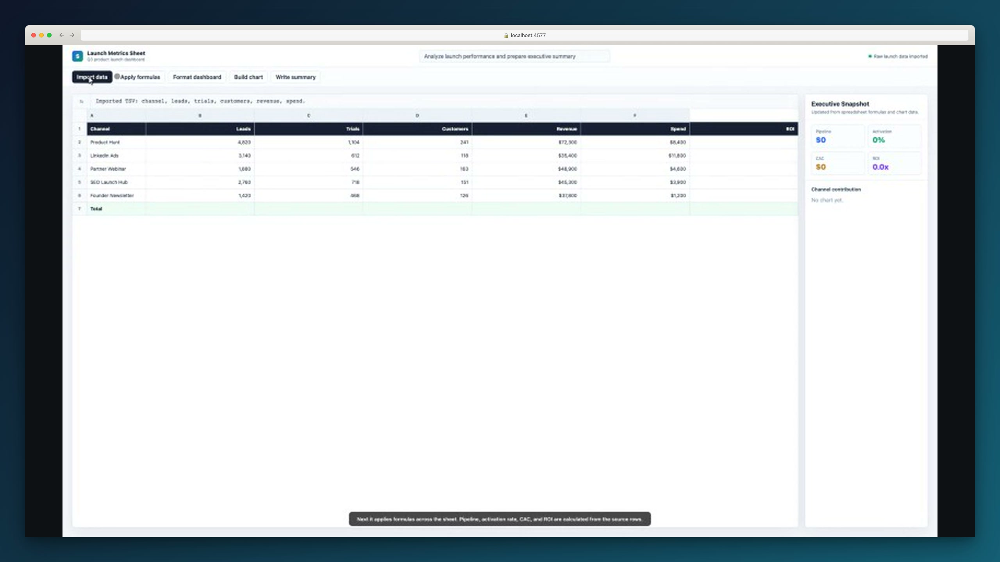

<div align="center">

# demo-dev

### Screen Studio for AI agents.

Give a URL and a goal. `demo-dev` operates the product, records the workflow, adds narration, frames the video, and exports a polished demo.

```bash
npx demo-dev demo --base-url https://your-app.com --prompt "Show the dashboard and create a new project" --frame --display-url app.example.com
```

[](./public/demo-dev-sheet-showcase.mp4)

</div>

---

## Monorepo layout

`demo-dev` is organized as a Bun + Turborepo monorepo:

```txt
apps/
  cli/        Published `demo-dev` CLI and library facade
  web/        Website app scaffold and built-in public showcases
packages/
  agent/      End-to-end demo pipeline orchestration
  ai/         AI provider abstraction
  browser/    Browser runtime: auth, probing, capture, Playwright sessions
  core/       Config, filesystem, git, and media utilities
  director/   Automatic visual direction for zooms and pacing
  exporter/   Aspect ratio, resolution, and capture viewport profiles
  quality/    Video quality checks and scoring
  planner/    Demo planning and presentation copy refinement
  render/     FFmpeg composition and visual planning
  style-presets/ Visual presets for SaaS, launch, tutorial, and social videos
  voice/      Narration scripts and TTS generation
  types/      Shared product/demo types
  demo-skill/ Agent skill package
```

This mirrors the same broad separation as Expect, but the domain is demoing rather than testing: browser/runtime code, agent orchestration, rendering, voice, and the CLI can evolve independently.

### Development

```bash
bun install
bun run build
bun run typecheck
bun run demo -- --base-url https://your-app.com --prompt "Show the dashboard"
bun --filter @demo-dev/web dev
```

### Built-in public showcase

The repo includes a controlled spreadsheet-style showcase for generating a README-ready public demo without depending on Google login or third-party app state.

Terminal 1:

```bash
bun run showcase:web
```

Terminal 2:

```bash
bun run showcase -- --quality high --frame --output-dir artifacts-showcase-sheet
```

---

## What it does

`demo-dev` opens your web app in a headless browser, navigates it like a human, records everything, adds AI narration, and renders a polished mp4.

- AI plans the demo from a natural language prompt
- Ghost-cursor moves the mouse with human-like Bezier curves
- Playwright screencast records continuously at 60fps
- CSS zoom animates smoothly into click targets (Screen Studio style)
- ElevenLabs / OpenAI / local TTS generates narration per scene
- FFmpeg composes the final video with speed ramps, browser frame, and audio

---

## Quick start

```bash
npm install -g demo-dev
npx playwright install chromium
```

Generate a demo:

```bash
demo-dev demo \
  --base-url https://your-app.com \
  --prompt "Show the onboarding flow and invite a teammate" \
  --frame
```

### Authenticated apps

```bash
demo-dev auth --base-url https://your-app.com --email you@example.com --password 'your-password'
demo-dev demo --base-url https://your-app.com --prompt "..." --frame
```

---

## Commands

```bash
demo-dev demo        # Full pipeline: prompt -> capture -> voice -> render
demo-dev auth        # Login and save browser session
demo-dev capture     # Record only (no voice/render)
demo-dev voice       # Generate TTS narration only
demo-dev render      # Capture + voice + compose video
demo-dev plan        # Generate demo plan from git diff
demo-dev probe       # Plan + probe pages for element discovery
demo-dev init        # Create config file in your project
demo-dev doctor      # Check environment (ffmpeg, playwright, etc.)
demo-dev config      # Show resolved config
demo-dev providers   # List available AI/TTS providers
demo-dev comment     # Post demo as a PR comment
demo-dev showcase    # Generate a built-in public showcase demo
```

Run `demo-dev <command> --help` for detailed options.

---

## Key flags

| Flag | Description |
|------|-------------|
| `--prompt "..."` | Natural language description of the demo to create |
| `--frame` | Wrap video in a browser window with gradient background |
| `--display-url` | URL label shown in the browser frame |
| `--quality draft\|standard\|high` | Video quality preset |
| `--base-url` | URL of the app to demo |
| `--base-ref` | Git base ref for diff-based planning (default: origin/main) |
| `--output-dir` | Where to write artifacts (default: artifacts) |

---

## AI & voice providers

Set via environment variables:

```bash
# AI planning (pick one)
DEMO_AI_PROVIDER=claude          # Uses local Claude CLI
DEMO_AI_PROVIDER=openai          # Uses OpenAI API
DEMO_OPENAI_API_KEY=sk-...

# Voice narration (pick one)
DEMO_TTS_PROVIDER=elevenlabs     # Best quality
DEMO_ELEVENLABS_API_KEY=sk_...
DEMO_ELEVENLABS_VOICE_ID=...

DEMO_TTS_PROVIDER=openai         # Good quality
DEMO_OPENAI_API_KEY=sk-...

DEMO_TTS_PROVIDER=local          # Free, uses macOS `say` command
```

---

## Config file

Create a `demo.dev.config.json` in your project:

```json
{
  "projectName": "My App",
  "baseUrl": "http://localhost:3000",
  "baseRef": "origin/main",
  "outputDir": "artifacts",
  "preferredRoutes": ["/", "/dashboard"],
  "featureHints": ["dashboard", "settings"],
  "auth": {
    "loginPath": "/login",
    "emailTarget": { "strategy": "css", "value": "#email" },
    "passwordTarget": { "strategy": "css", "value": "#password" },
    "submitTarget": { "strategy": "role", "role": "button", "name": "Login" }
  }
}
```

---

## How it works

```
prompt + URL
     |
     v
Playwright explores the site (screenshots + interactive elements)
     |
     v
AI generates a demo plan (scenes, actions, narration text)
     |
     v
ghost-cursor executes actions with human-like mouse movement
     |
     v
page.screencast records continuous video + CSS zoom on interactions
     |
     v
ElevenLabs/OpenAI generates narration audio per scene
     |
     v
FFmpeg composes: speed ramps + browser frame + audio sync
     |
     v
polished mp4
```

---

## Requirements

- Node.js >= 20
- FFmpeg (install via `brew install ffmpeg` or equivalent)
- Chromium (installed via `npx playwright install chromium`)

---

## License

MIT
